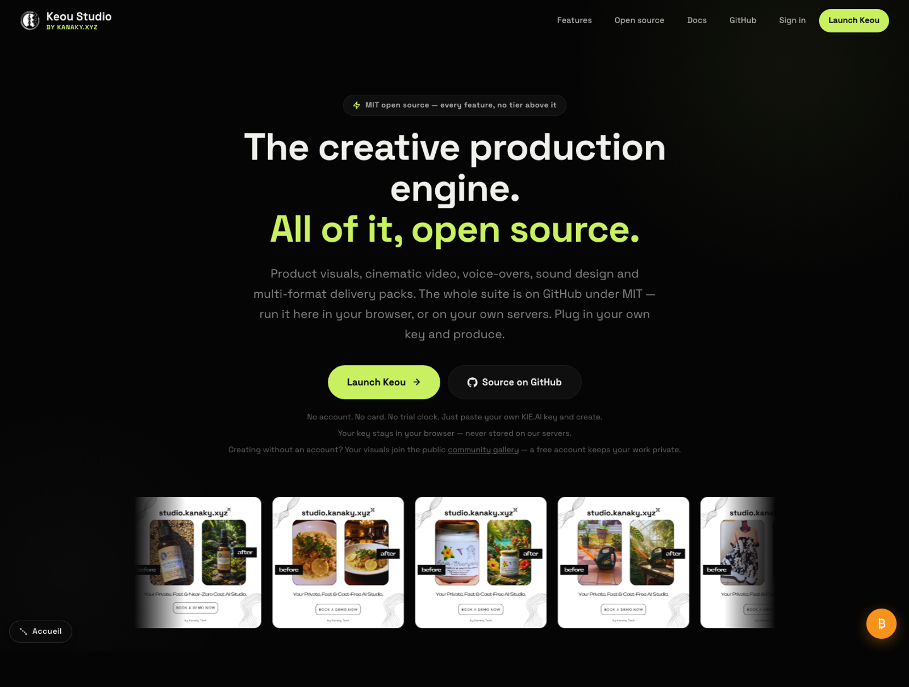
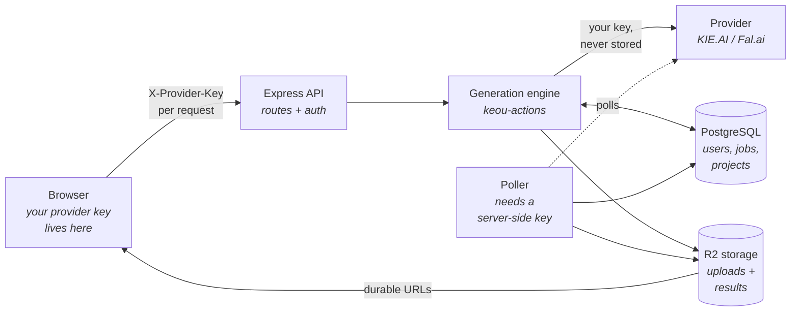
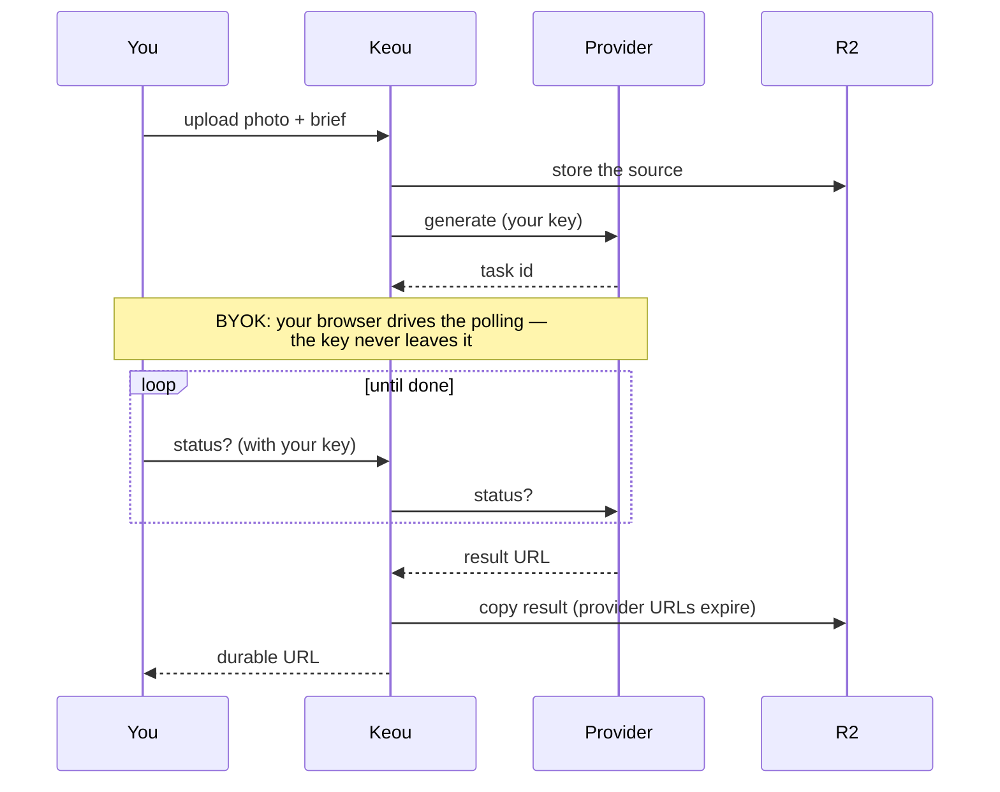
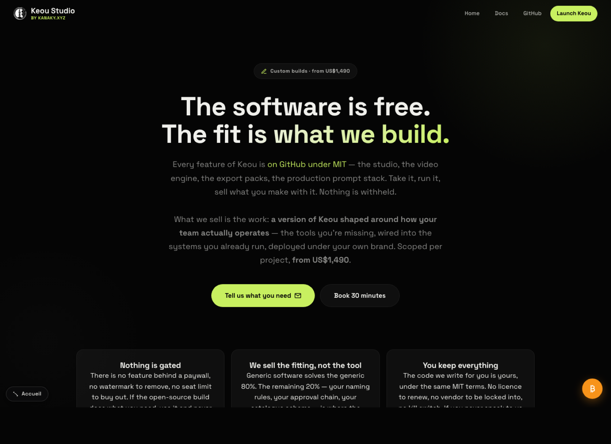

<div align="center">


# Keou Studio

**One raw product photo in. A full commercial campaign out.**

Product images, cinematic video, voice-overs, sound design and multi-format delivery packs.
**Try it in 10 seconds — no account, no install, no GPU:** [studio.kanaky.xyz/launch](https://studio.kanaky.xyz/launch).
Or run it yourself: MIT, your own API keys, or **fully local with ComfyUI**.

[](LICENSE)
[](https://nodejs.org)
[](https://github.com/kanakytech/keou/releases)
[](https://studio.kanaky.xyz/launch)
[](https://huggingface.co/spaces/kanakytech/keou-studio)

<p>
  
  
  
  
</p>
<sub>Real renders from the hosted studio — the product in each shot is pixel-locked, never redrawn.</sub>

[Try it without installing](https://studio.kanaky.xyz/launch) ·
[Hugging Face Space](https://huggingface.co/spaces/kanakytech/keou-studio) ·
[Full documentation](https://studio.kanaky.xyz/docs.html) ·
[Quick start](#quick-start) ·
[Configuration](#configuration) ·
[API](#http-api) ·
[Custom builds](#custom-builds)

</div>

---



## Everything ships here

There is no paid tier holding features back. Polish, remix, format adaptation, export
packs, voice, sound, upscaling, teams, sharing — and the production prompt stack that
makes the output good — are all in this repository, under MIT.

Three files stay in our private repo, and none is a feature: our provider costs and
margin table, the Stripe plumbing that bills *our* hosted instance, and the operator
credit top-ups behind it. Nothing in the studio reads them.

<details>
<summary><b>Previously</b> — how this edition stopped being a funnel</summary>

> This edition was deliberately cut down — image and video only — as a
> funnel toward a licence that unlocked the rest. That funnel is gone.
>
> We still sell something, but it is a different kind of thing: the licence was money
> for **software that already existed**, and a custom build is money for **work that
> does not exist yet**. There is no price list, because there is no product to price.
> If the public build does what you need, you owe us nothing — and that is the outcome
> we expect for most people who read this.

</details>

---

## What it does

| Capability | What it means |
|---|---|
| **Product images** | Drop a photo, get a commercial scene around it. The product stays pixel-locked — shape, text, labels and logos are never redrawn. |
| **Cinematic video** | Product clips from a still. Engines: Grok Imagine, Kling 2.6 / 3.0, Seedance 2, Veo 3. |
| **Polish** | Retouch a render without regenerating it — lighting, blemishes, background cleanup. |
| **Remix** | Re-imagine an existing render in a new direction, keeping the product identical. |
| **Format adapt** | One render becomes every aspect ratio your channels need, recomposed rather than cropped. |
| **Export packs** | Platform-ready variants from a single approved visual, in one action. Three presets ship (1, 4 and 8 formats); `src/lib/packs.js` is a plain list you extend. |
| **Voice & sound** | Voice-overs and sound effects for the clips, in the same pipeline. |
| **Upscaling** | Images and video, ×4 or ×8 (Topaz). Those are the only two factors the routes accept; anything else falls back to ×4. |
| **Local engine** | Plug in your own ComfyUI: images, polish, remix, adapt and upscaling run fully local — no cloud, no per-image cost. See [Fully local](#fully-local-no-cloud). |
| **Clients & campaigns** | Organise output by client, campaign and approval state. |
| **Share links** | Send a client a review link and collect structured feedback. |
| **Teams** | Accounts, roles and quotas for a studio of more than one. |
| **Assistant** | A chat agent that drives the whole toolset for you. Needs your own Anthropic key. |
| **Batch** | Dozens of generations queued in parallel with live progress. |

### The hosted demo is not the same deal as your own install

[studio.kanaky.xyz/launch](https://studio.kanaky.xyz/launch) lets you try all of
this without installing anything, and it costs nothing — but it is a public,
account-less surface, so it trades differently. Saying so here rather than
letting you discover it after a generation:

| | Hosted demo (`/launch`, no account) | Your own install |
|---|---|---|
| **Watermark** | Every image (sharp) and every video (ffmpeg) is stamped `studio.kanaky.xyz`. Audio is not — nothing can be written into a soundtrack without ruining it. | None. Nothing stamps anything. |
| **Downloads** | No download button. Results are served through a protected proxy. | Full: signed downloads, export pack ZIPs. |
| **Privacy** | Everything created is **public** in the community gallery. A blocking consent screen says so before your first generation. | Yours. Nothing is published anywhere. |
| **Caps** | A shared queue: 3 generations running at once, 60 waiting, 20 per network address. When it is full it tells you how long to wait. | Whatever your provider key and your server allow. |

The code behind that demo is in this repository — it is the `community` edition
of the same server, and none of those limits apply to an install you run.

---

## Quick start

### What you need

| | |
|---|---|
| **Node.js** | ≥ 20 |
| **PostgreSQL** | any recent version |
| **A generation engine** | [KIE.AI](https://kie.ai?ref=ec0e98ef53c18d6f13f05629a9ffd793) or [Fal.ai](https://fal.ai) keys (each user pastes their own) — **or your own [ComfyUI](https://github.com/comfyanonymous/ComfyUI) for fully local images**, see [Fully local](#fully-local-no-cloud) |
| **Object storage** | A Cloudflare R2 bucket (free tier is enough). **Required to upload anything** — `POST /api/upload` returns 503 without it, and uploading a photo is the product's first move. It also keeps results alive past the ~14 days a provider URL lasts. |
| **ffmpeg** | Optional — only for the public anonymous studio. It stamps `studio.kanaky.xyz` into generated video the way sharp already does for images. Without it, video is served unwatermarked and a line is written to the log; nothing else breaks. The bundled `Dockerfile` installs it for you. `GET /health` reports what is actually installed — see below. |

`GET /health` answers with a `media` block so you never have to guess whether a
rebuilt image still carries the watermarking tools:

```json
{ "ok": true, "uptime": 3812.4,
  "media": { "ffmpeg": "6.1.1-3ubuntu5", "sharp": "0.35.3",
             "videoWatermark": true, "imageWatermark": true } }
```

`null` means the binary is missing. It is reported, never enforced: a missing
binary leaves `/health` green, because the service still works — it just
watermarks less. The probe runs once at startup and is memoised, so container
healthchecks hitting it every 30 s cost nothing.

### Run it — one command

```bash
git clone https://github.com/kanakytech/keou.git && cd keou
printf 'JWT_SECRET=%s\nADMIN_EMAIL=you@example.com\nADMIN_PASSWORD=change-me-now\n' "$(openssl rand -hex 32)" > .env
docker compose up -d
```

That's it — PostgreSQL included. Open **http://localhost:3401** and sign in with the
`.env` credentials. Add `--profile local` to also start a ComfyUI generation engine
(see [Fully local](#fully-local-no-cloud)).

### Run it — by hand

```bash
git clone https://github.com/kanakytech/keou.git
cd keou
npm ci
cp .env.example .env
$EDITOR .env          # four values to fill in — see just below
npm start
```

> `npm start` refuses to boot on an empty `JWT_SECRET`, and says so. That is the
> template doing its job: there is no default secret to leak.

Four values in `.env`, and the last two matter as much as the first two:

```
DATABASE_URL=postgresql://…      # your database
JWT_SECRET=…                     # openssl rand -hex 32
ADMIN_EMAIL=you@example.com      # seeds your account on first boot
ADMIN_PASSWORD=…                 # use 12+ chars — nothing checks this one
```

`JWT_SECRET` is the only value validated at boot (16 chars minimum, or the
process exits saying so). `ADMIN_PASSWORD` is hashed and seeded as given — the
12-character minimum is enforced on *signup* and *password change*, never on
the seed. Pick a real one: it is the account that owns the instance.

Without `ADMIN_EMAIL` / `ADMIN_PASSWORD` the instance boots with **no way to sign in**:
public self-serve signup is off by default in a self-hosted deployment, on purpose.

Open **http://localhost:3401**, sign in, paste your provider key in the key bar and
produce.

### Docker

```bash
docker build -t keou .
docker run -p 3401:3401 --env-file .env keou
```

The image runs as a non-root user and ships a healthcheck on `/health`. It sets
`NODE_ENV=production`, which turns Postgres TLS on — if your database is local and
speaks plain TCP, add `DATABASE_SSL=0` to your `.env`.

### Railway

1. New project → **Deploy from GitHub** → this repo (or your fork)
2. Add a **PostgreSQL** service — `DATABASE_URL` is injected for you
3. Set `JWT_SECRET`, `ADMIN_EMAIL`, `ADMIN_PASSWORD` and the `R2_*` variables
4. Deploy. `railway.json` and the healthcheck are already configured.

Skip `ADMIN_EMAIL` / `ADMIN_PASSWORD` and the deploy succeeds, the healthcheck goes
green, and nobody can sign in — the database has no account to let through.

---

## Fully local (no cloud)

Point Keou at a [ComfyUI](https://github.com/comfyanonymous/ComfyUI) instance and
**image generation, polish, remix, format adapt and upscaling run on your own
hardware** — no provider key, no per-image cost, nothing leaves your machine.

```bash
# your ComfyUI is at http://localhost:8188 with at least one checkpoint installed
LOCAL_ENGINE_URL=http://localhost:8188
DEFAULT_PROVIDER=local
```

Or let compose start one next to Keou:

```bash
docker compose --profile local up -d
# then: set DEFAULT_PROVIDER=local in your .env (compose defaults to kie),
# and drop a checkpoint into ./comfyui/checkpoints (FLUX schnell fp8, or any
# SDXL) — upscale models go into ./comfyui/upscale_models.
# No NVIDIA GPU on the host? Remove the deploy: block from the comfyui
# service (CPU, slow). On Apple Silicon, run ComfyUI natively instead.
```

How it behaves, honestly:

- Keou **auto-detects your installed models** (`/object_info`) — set
  `LOCAL_CHECKPOINT` / `LOCAL_UPSCALE_MODEL` to pin specific ones. Sampling is
  tuned by model family (FLUX schnell → 4 steps, FLUX dev → 20, SD/SDXL → 25).
- With a reference photo, the local engine runs img2img at low denoise — an
  **approximation** of the pixel-locked product fidelity the cloud editing
  models give. Good, not identical. Judge it on your own products.
- **Video, voice and sound effects still need a cloud key** (KIE.AI or Fal.ai).
  Local video is on the roadmap; we would rather say "not yet" than ship a
  workflow that breaks on half the installs.
- A GPU is strongly recommended. CPU works for testing; you will not enjoy it.
- **Apple Silicon (M-series Macs): install ComfyUI natively**, not through the
  compose profile — Docker on macOS has no GPU passthrough, but native ComfyUI
  uses Metal and works well. A 16 GB M3 renders SDXL in ~1-3 min per image and
  upscales in seconds; FLUX schnell wants 16 GB+ and patience.

---

## FAQ — the objections, answered up front

**Why BYOK instead of bundled credits?**
Because bundled credits mean a markup, and a markup means a paywall. With your
own key you pay the provider's price — typically **a few cents per image** —
and this platform adds zero on top. With your own ComfyUI you pay nothing at all.

**So what does a visual actually cost me?**
Cloud: cents per image, more for video (each engine's rate is shown before you
run it). Local: your electricity. The hosted demo at
[studio.kanaky.xyz/launch](https://studio.kanaky.xyz/launch) is free — bring a
key, results are watermarked and public.

**Is it *really* open source?**
MIT, everything: the studio, the prompt stack that makes outputs good, packs,
teams, share links, the MCP server. Three private files exist and none is a
feature — our margin table and the Stripe plumbing for *our* hosted instance.
Use Keou for client work, rebrand it, keep the money. No fees, no attribution.

**How is this different from ComfyUI?**
ComfyUI is a node graph for building generation workflows — maximum control,
steep learning curve. Keou is the layer above: a production studio for people
who need fifty on-brand product visuals before lunch, not a graph editor. Since
ComfyUI can BE Keou's engine, they compose rather than compete.

**Why is the product "pixel-locked"? What does that mean?**
The scene around your product is generated; the product itself — shape, text,
labels, logos — is not redrawn. On cloud editing engines this is native; on the
local engine it is approximated with low-denoise img2img.

---

## How it fits together



**The key never touches the server's disk.** It lives in your browser's `localStorage`,
rides each request in an `X-Provider-Key` header, is used for that single provider call,
and is never written to disk, database, or logs.

> **The trade-off, stated plainly.** Because the key exists only inside a request, the
> background poller has no key of its own in a bring-your-own-key deployment — it cannot
> finish a job on your behalf. Your browser drives the polling, and the result is stored
> the moment it lands. Close the tab mid-generation and the job stays pending until you
> come back (the studio picks it up again from `/api/pending`); the provider's own URL
> expires after about 14 days.
>
> If you would rather the server complete jobs unattended, set a server-side
> `KIE_API_KEY` or `FAL_API_KEY`. The poller then works normally — at the cost of the
> guarantee above. That choice is yours, and it is the whole reason the guarantee is
> real rather than marketing.

### A generation, step by step



---

## Configuration

Copy `.env.example` to `.env`. Four values are mandatory in practice: the two
below, plus `ADMIN_EMAIL` and `ADMIN_PASSWORD` — without them the instance boots
with no account, and the sign-in page has nothing to let you through.

### Required

| Variable | Notes |
|---|---|
| `DATABASE_URL` | PostgreSQL connection string. Migrations run automatically at boot. |
| `JWT_SECRET` | Session signing secret, 16 chars minimum. Generate with `openssl rand -hex 32`. |

### Storage — required to upload

| Variable | Notes |
|---|---|
| `R2_ACCOUNT_ID` | Cloudflare account id |
| `R2_ACCESS_KEY` / `R2_SECRET_KEY` | R2 API token pair |
| `R2_BUCKET` | Bucket name (default `keou-uploads`) |
| `R2_PUBLIC_URL` | Public bucket domain, e.g. `https://assets.example.com` |

Skip these and the app boots, serves its pages, and refuses every upload with a 503
naming the missing variables. Nothing else in the studio works without an image going
in, so treat storage as required rather than recommended.

### Optional

| Variable | Default | Notes |
|---|---|---|
| `PORT` | `3401` | HTTP port |
| `EDITION` | `opensource` | Set by `index.js`; leave it alone |
| `DEFAULT_PROVIDER` | `kie` | `kie` or `fal` |
| `KIE_API_KEY` / `FAL_API_KEY` | — | A server-side fallback key. Leave unset for pure BYOK. |
| `ANTHROPIC_API_KEY` | — | Enables the assistant. Without it, the chat returns a clear error and nothing else breaks. |
| `ANTHROPIC_MODEL` | `claude-sonnet-5` | Model backing the assistant |
| `OPENAI_API_KEY` | — | Speech-to-text for voice input in the assistant |
| `ADMIN_EMAIL` / `ADMIN_PASSWORD` | — | **Effectively required.** Seeds your account on an empty database — without them a self-hosted instance has no way to sign in. |
| `DATABASE_SSL` | — | Set to `0` to disable Postgres TLS. Needed with Docker against a local database. |
| `AGENCY_NAME` | `Keou` | Shown across the interface |
| `AGENCY_IMAGE_QUOTA` / `AGENCY_VIDEO_QUOTA` | `500` / `50` | Seed values for the counters shown in the admin panel. **Not enforced in this edition** — every generation is paid on the caller's own provider key, so there is nothing to meter: `requireCredits` returns immediately and `deductCredits` only records a row for the analytics screens. Raise them if you want the dashboard to read sensibly; you will not be cut off at 500. *(This table used to say the defaults were a real ceiling. They never were, in this edition.)* |
| `JWT_EXPIRES` / `REFRESH_EXPIRES` | `15m` / `30d` | Token lifetimes |
| `DATABASE_SSL_STRICT` / `DATABASE_CA` | — | Certificate pinning for managed Postgres |
| `DISABLE_POLLER` | — | Set to `1` on replicas so only one instance polls |

---

## HTTP API

Every route is under `/api`. The generation routes sit directly on `/api` —
`/api/video`, not `/api/generate/video`. Authenticated routes take
`Authorization: Bearer <token>` from `POST /api/auth/login`, or a long-lived key from
`POST /api/keys` for scripts and MCP clients.

<details>
<summary><b>Generation</b> — mounted directly on <code>/api</code></summary>

| Method | Path | Does |
|---|---|---|
| `POST` | `/api/generate` | Image from a source photo + brief |
| `POST` | `/api/video` | Video from a still |
| `POST` | `/api/polish` | Retouch an existing render |
| `POST` | `/api/remix` | Re-imagine in a new direction |
| `POST` | `/api/adapt` | Recompose to other aspect ratios |
| `POST` | `/api/upscale` | Upscale a render |
| `GET` | `/api/status/:type/:taskId` | Poll a running job |
| `GET` | `/api/packs` | Available pack definitions |
| `POST` | `/api/pack` | Start an export pack |
| `GET` | `/api/pack/:packId/status` | Pack progress |
| `GET` | `/api/pack/:packId/zip` | Download the finished pack |
| `GET` | `/api/pending` | Your unfinished jobs (used to resume after a reload) |

Pass `generationId` when polling `/api/status` — without it the result is returned but
never persisted, and you end up holding a provider URL that expires.

</details>

<details>
<summary><b>Content & organisation</b></summary>

| Route | Does |
|---|---|
| `/api/upload` | Source images — field name `image`, 20 MB cap. Video is a separate route: `POST /api/upload/video`, field name `video`, 50 MB cap, `mp4` / `mov` / `mkv`. Both return 503 with the missing variable names if R2 is not configured. |
| `/api/download` | Signed download of a result |
| `/api/history` | Your library — list, tag, bulk-move, delete |
| `/api/projects` | Clients |
| `/api/campaigns` | Campaigns within a client |
| `/api/share` | Review links and client feedback |
| `/api/tools` | Voice-over, sound effects, image and video upscaling |

</details>

<details>
<summary><b>Account & team</b></summary>

| Route | Does |
|---|---|
| `/api/auth` | Register, login, refresh, logout, change password |
| `/api/profile` | Read and update your profile |
| `/api/keys` | Long-lived API keys for scripts and MCP (shown once, stored hashed) |
| `/api/team` | Invite members, roles, reset, remove |
| `/api/admin` | Instance settings, quotas, branding *(admin)* |
| `/api/analytics` | ROI, clients, velocity, campaigns, savings *(admin)* |
| `/api/activity` | Instance activity log *(admin)* |
| `/api/dashboard` | Dashboard aggregates |

</details>

<details>
<summary><b>Assistant</b> — <code>/api/jarvis</code></summary>

| Method | Path | Does |
|---|---|---|
| `POST` | `/api/jarvis/chat` | Streaming agent loop with the full toolset |
| `POST` | `/api/jarvis/stt` | Speech to text |
| `POST` | `/api/jarvis/tts` | Text to speech |

Requires `ANTHROPIC_API_KEY`, or a key saved in **Settings → API Keys**.
`/api/conversations` stores the chat history.

</details>

---

## Staying up to date

This repository is rebuilt from the Keou core on every change: engine improvements,
provider updates and security fixes land here as commits on `main`.

- **Railway with GitHub deploy** — enable auto-deploy on `main`, updates ship themselves.
- **Self-host** — `git pull && npm ci` and restart.

Issues and pull requests are welcome.

---

## Custom builds

Use this for free, forever, including commercially. MIT means you can run it for clients,
charge them, and keep the money. Attribution is appreciated, not required.

What we sell is the work of making it fit: **3D models, music, sound design, editing,
VFX** — and anything else your pipeline needs that the public build doesn't do yet.
Integration with the systems you already run (PIM, DAM, storefront, approval chain).
Deployment on your own infrastructure, under your own brand.

There is no price list. Tell us what you need, we scope it together, and you get a
fixed number in writing before anything starts. You own what we write, under the same
MIT terms.

[**Read the custom builds page →**](https://studio.kanaky.xyz/custom.html) ·
[kevyn@kanaky.xyz](mailto:kevyn@kanaky.xyz)



---

## Licence

[MIT](LICENSE) © [Kanaky Tech](https://kanaky.xyz)

Run it, modify it, fork it, use it for client work, charge for that work, keep the
money. No licence fee, no revenue share, no attribution requirement.

**One thing you should know before deploying**, because we would rather say it than
have you find it: the build carries a provenance mark in three places — a `.origin`
dotfile, an `X-Origin-Sig` response header, and a keyword in `package.json`. All three
decode to the same string naming Kanaky Tech as the author. It phones nothing home, it
gates nothing, and you can delete all three: the header lives at the top of
`server.js`, the rest are plain files. We mention it because an undisclosed header is
the kind of thing that deserves to be found in the README, not in a diff.

<div align="center">
<sub>Built in Auckland, Aotearoa by <a href="https://www.linkedin.com/in/kevyn-wahuzue">Kevyn Wahuzue</a> · <a href="https://kanaky.xyz">kanaky.xyz</a></sub>
</div>

---

## Affiliate disclosure

The KIE.AI links in this README and on studio.kanaky.xyz carry our referral code.
KIE pays us a share of a referred user's first-month spend. It costs you nothing —
the price is identical — and Keou works with any provider key, however you obtained
it. Self-hosted deployments can point those links wherever they like; nothing in the
code depends on ours.
